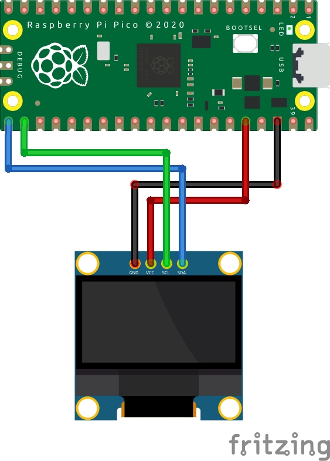

# OLED(SSD1306)

## Quick Start

After establishing a connection with Raspberry Pi Pico using `mpremote`, execute the following command.

```bash
./run.sh
```

## Components



- Raspberry Pi Pico / Raspberry Pi Pico W
- OLED 128x64 display (SSD1306)

## How to Run

### Install Dependencies

This code uses `ssd1306`, so please install the package using `mip`.

```bash
mpremote mip install ssd1306
```

### Upload Files

Upload the required image data file (`lenna.dat`) and executable file (`main.py`) for operation.

```bash
mpremote cp lenna.dat :
mpremote cp main.py :
```

## Reference

- https://github.com/arcostasi/pico-projects/blob/main/micropython/ssd1306_pico.py
